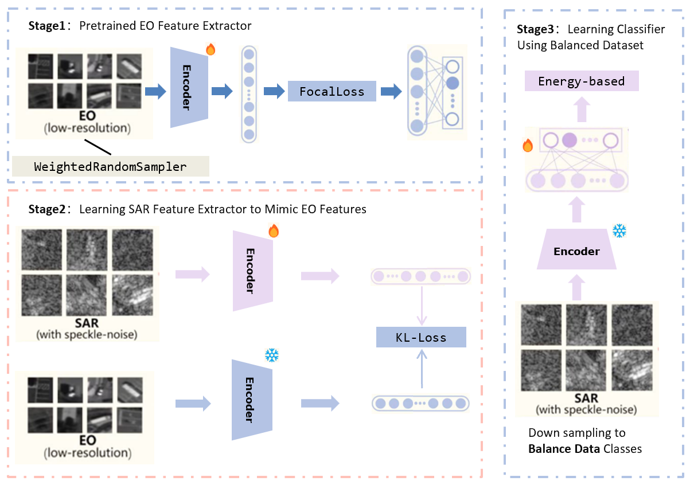

# NJUST-KMG

## Approach

### This is the overall framework of our proposal



## Environment

First, [install PyTorch 1.13.1](https://pytorch.org/get-started/locally/) (or later) and torchvision, as well as small additional dependencies, and then install this repo as a Python package. On a CUDA GPU machine, the following will do the trick:

Run the following command to configure the environment:

```bash
conda create -n XXX python=3.7
conda activate XXX
pip3 install -r requirements.txt
```

## Training

First, we embarked on the training of an EO image classifier to achieve high classification accuracy. Focal loss optimization was employed to address the challenge posed by class imbalance effectively. Additionally, the utilization of WeightedRandomSampler optimized the sampling process, leading to further enhancements in the classification performance.

```bash
python pretrain.py
```

The second step involves freezing the weights of the EO classification model and transferring the acquired knowledge from the EO model to the SAR classification model through a process known as knowledge distillation. This strategic approach leverages the information-rich nature of EO (Electro-Optical) images, with the goal of guiding the SAR (Synthetic Aperture Radar) classification model to achieve a similarly effective classification performance.

To initiate the model distillation process, execute the following command, utilizing the Kullback-Leibler (KL) divergence as the chosen loss function. This loss function is optimized to capture the distributed similarity between the EO and SAR features:

```bash
python sar_feature.py
```

In the third step, the focus shifts to fine-tuning the SAR classification model post-distillation. Specifically, only the classification head of the model is trained, and to address the issue of class imbalance, a class balance sampler is constructed. Execute the provided command to successfully carry out this step:

```bash
python finetune.py
```

## Inference

To finalize the reasoning process, the SAR model's predicted results are subjected to Test-Time Augmentation (TTA), incorporating horizontal flip, rotation, and multi-resolution testing. Additionally, test samples are clustered, and a voting mechanism is applied within each cluster. The label correction follows a winner-take-all strategy. For Out-of-Distribution (OOD) detection, an energy-based approach is employed to infer the confidence of detecting out-of-distribution instances. Execute the following command to execute these steps:

```bash
python results.py
```
